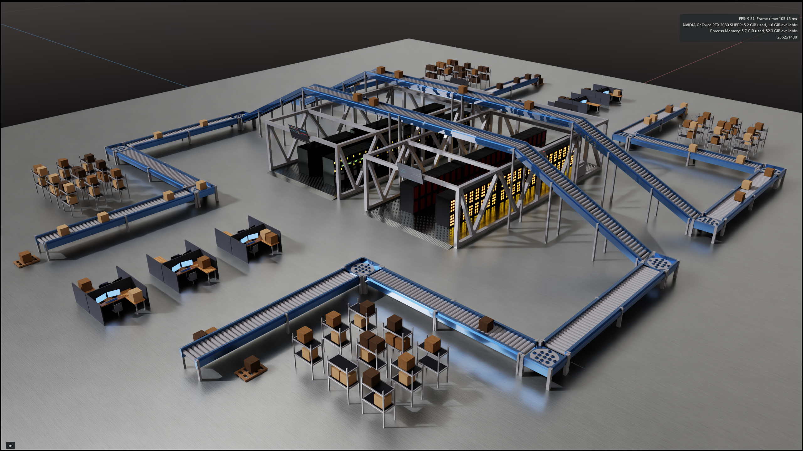
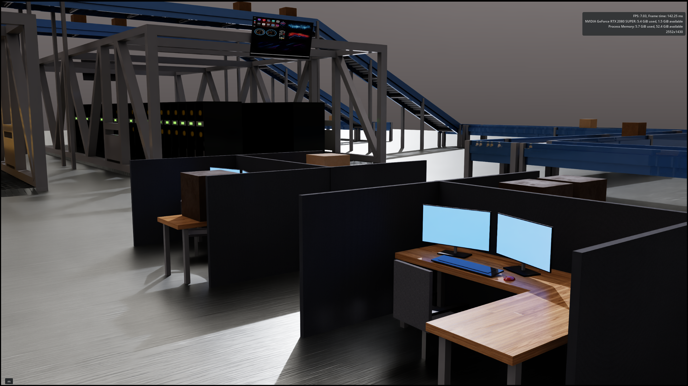
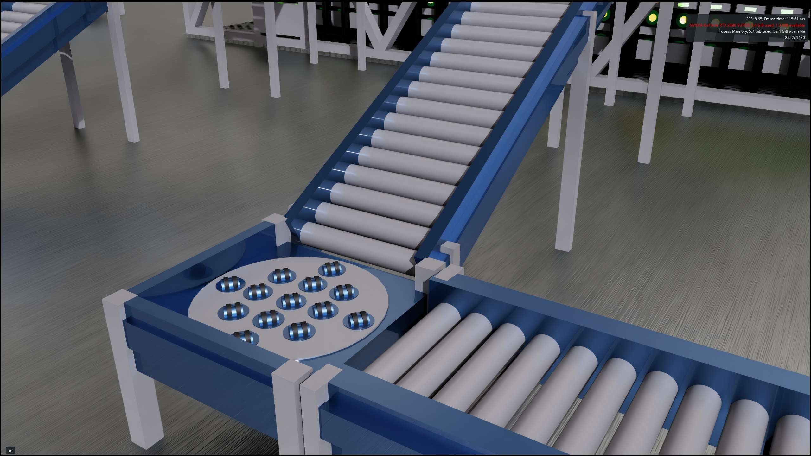
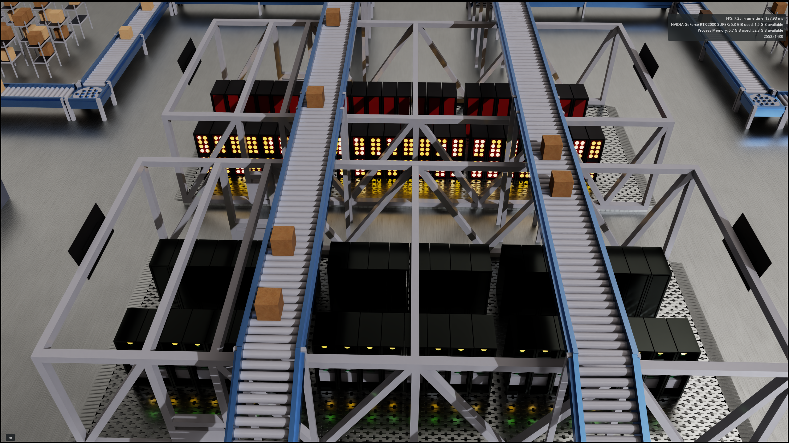

# AI-Driven Digital Twin — Camera Agent Target Tracking

---

## 🚀 Project Overview

This project demonstrates an **AI-driven camera agent operating inside a Digital Twin environment** performing real-time scanning, target acquisition, and lock-on using bounding box detection and spatial reasoning built in NVIDIA Omniverse + Isaac Sim.

### The Agent:
- Starts from a fixed overview position  
- Navigates through the environment using waypoint logic  
- Actively scans for a target (red warning light)  
- Reacquires the target if lost  
- Performs a controlled fly-in  
- Executes final visual alignment using bounding-box perception  

This is a **full perception → decision → action loop**, representing a foundational architecture for autonomous systems in digital twins.

---

## 🎯 Key Achievement

> The Camera Agent successfully detects, navigates to, and visually locks onto a real target in a complex 3D environment — without requiring a predefined starting distance.

<p align="center">
  
</p>

<p align="center">
  <em>Camera agent scanning, reacquiring, and locking onto a red warning light using vision-driven control.</em>
</p>

This result demonstrates a full **perception → decision → action loop** operating inside a digital twin, where the agent detects the warning light, navigates toward it, reacquires it when needed, and completes final visual alignment.

---

## 🧠 System Architecture

### 1. Perception Layer
- Synthetic camera using Replicator  
- Semantic labeling (`warning_light`)  
- Bounding box detection (`bounding_box_2d_tight`)  
- Multi-prim merging into a unified target  

---

### 2. Decision Layer (State Machine)

The agent operates using a structured state system:

```text
scan_overview → move_to_overview → scan_investigate →
move_to_investigate → approach_target → inspect_hold
```

Each state is responsible for:
- Exploration  
- Target acquisition  
- Navigation  
- Final alignment  

---

### 3. Control Layer
- Yaw-based steering  
- Forward vector projection  
- Visual servoing using bounding box center error  
- Dead-zone stabilization  

---

## 🔍 Visual Servoing (Core Innovation)

At close range, the agent transitions from navigation to **vision-driven alignment**:

```python
bbox_error = bbox_center_x - image_center_x
yaw += k * bbox_error
```

This allows:
- Smooth target centering  
- Stable lock-on behavior  
- Real-time correction without oscillation  

---

## 🏗️ Environment

The Digital Twin represents a warehouse / server environment with:
- Conveyor systems  
- Structural framing  
- Server racks  
- Workstations  
- Target: red warning light  

---

## 📸 Highlights

These renders showcase the Digital Twin environment from multiple perspectives, highlighting system layout, asset organization, and operational context.

### 1. Full System Overview
A top-down view of the entire warehouse layout including conveyors, workstations, and the central target zone.  


---

### 2. Storage & Inventory Zone
Structured storage racks and boxed inventory used for perception and spatial reasoning validation.  


---

### 3. Workstation Integration
Operator workstations integrated into the digital twin environment.  


---

### 4. Conveyor System Detail
Mechanical conveyor junction showing motion flow and occlusion complexity.  


---

### 5. Target Zone (Server Core)
Central enclosure containing the red warning light target used for detection.  


---

## 🧪 Technical Stack

- NVIDIA Omniverse  
- Isaac Sim 4.2 (containerized)  
- OpenUSD  
- Python  
- Replicator  

---

## ⚙️ Key Features

- Fixed world-space start pose  
- Waypoint-based navigation  
- Dynamic target acquisition  
- Occlusion handling  
- Target reacquisition via scanning  
- Stabilized stopping logic  
- Bounding-box driven alignment  

---

## 🧱 Project Structure

```text
project_07_ai_driven_digital_twin_system/
├── images/
├── media/
├── isaac/
│   └── agent_perception_*.py
├── models/
├── usd/
├── output/
└── docs/
```

---

## 🧭 What This Demonstrates

- Real-time perception in simulation  
- Digital Twin interaction logic  
- Autonomous agent behavior design  
- OpenUSD-based reasoning  
- Robotics-style control systems  

---

## 🔮 Next Steps

- Multi-agent coordination  
- Depth-based navigation  
- Full 6-DOF camera control  
- Learning-based policies (DQN)  
- Sim → Real transfer (Cosmos pipeline)  

---

## 🏁 Summary

This is not just a simulation.

It is a functional AI agent operating inside a Digital Twin, capable of:
- Perceiving its environment  
- Making decisions  
- Acting with purpose  
- Achieving a defined objective  

---

## 👤 Author

**Dartayous Hunter**  
Digital Twin Engineer (OpenUSD | Omniverse | AI Systems)